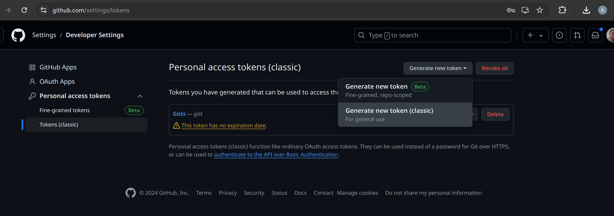
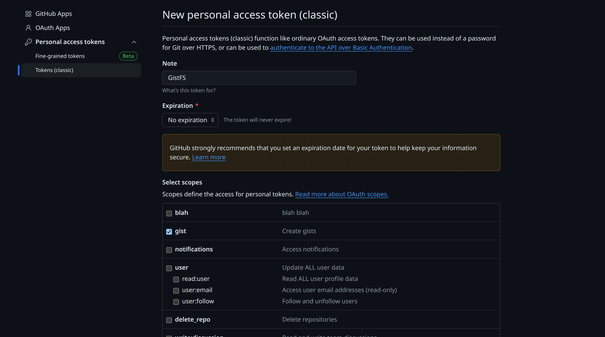

# gist-fs

<sup>**Social Media Photo by [Gary Ellis](https://unsplash.com/@garyellisphoto) on [Unsplash](https://unsplash.com/)**</sup>


A daily rate-limited way to have free storage in the wild.

### ⚠️ Warning

It is very important to understand that *GitHub* tokens are extremely powerful and could damage your projects if leaked in the wild, hence I wrote this *Fight Club* style rules to keep in mind:

  * the **first rule** of this module, is that **you don't expose your GitHub token** in the wild
  * the **second rule** of this module, is that **you don't ignore the first rule** in this list
  * the **third rule** of this module is that **it's your fault if you ignored previous rules** on this list

If you believe your personal token leaked remember to revoke it and create a new one, bing more careful next time 👍

## 🛈 GitHub Token

In order to use this module you need to generate a new token, possibly dedicated to *gists* things only.

Please [go in settings/tokens](https://github.com/settings/tokens) to do so, after being logged in, and do the following:



Once you reach that lovely interface, please constrain such token to deal with *gists* only, so that a potential leak won't grant any other "*super power*" for your account:



Once you have done that and you have your *read-once* token, please do not store it in any *HTML* or *JS* or *CSS* file, or anyone else, as that's your token to be able to use this module and you don't want that to be abused by anyone out there.

**If your token leaks** please remember to start again the procedure, remove the previous one, and not commit the same mistake again 😉

**[Live Demo](https://webreflection.github.io/gist-fs/test/) that creates a new Gist** on your behalf once you have provided your TOKEN, that will be stored in `localStorage`, and then check the devtools console.

## API

This module provides various ways to bootstrap an instance of *GistFS*.

```js
import {
  // the class as it is
  GistFS,
  // aliases to create a new instance
  gist_fs, gistFS,
  // aliases to create a new instance
  // and retrieve the TOKEN from localStorage
  gist_key_fs, gistKeyFS,
} from 'https://esm.sh/gist-fs';

const TOKEN = '<YOUR_PRIVATE_GITHUB_TOKEN>';

// direct class initialization
const a = new GistFS(TOKEN);

// indirect class initialization
const b = gist_fs(TOKEN);
const c = gistFS(TOKEN);

// indirect class initialization that
// will prompt for the token once
const c = gist_key_fs('unique_project_name');
const d = gistKeyFS('unique_project_name');
// unique_project_name is the localStorage key
```

### GistFS

This class requires the *authorization token* when constructed:

```js
const gfs = new GistFS(AUTHORIZATION_TOKEN);
```

The instance will expose the following methods.

#### create(options = {})

[Create a new gist](https://docs.github.com/en/rest/gists/gists?apiVersion=2022-11-28#create-a-gist) and return its most important details:

```ts
type GistDetails = {
  id:string,
  files:object,
  description:string,
  html_url:string,
  created_at:string,
  updated_at:string,
  public:boolean,
  comments:number,
  fs:GistFSHandler,
}
```

Differently from *Octokit*, the files can be passed as paths that will be handled via ease through the `fs` *GistFSHandler* instance.

```js
const { id, fs } = await gist.create({
  description: 'GistFS live demo - example',
  'public': false,
  files: {
    './README.md': {
      content: '# Hello Gist'
    },
    // a `sub` folder example
    './sub/a.txt': {
      content: 'a'
    },
    './sub/b.txt': {
      content: 'b'
    },
  }
});

// hint: store the id to not always create a new gist
localStorage.set('gist_id', id);

// list gist content
fs.ls('./');
// ['README.md', 'sub']

fs.isDir('./sub'); // true

fs.ls('./sub');
// ['a.txt', 'b.txt']

fs.stats('./sub');
// { directory: true, files: ['a.txt', 'b.txt'] }

fs.stats('README.md');
// all details about the file as returned by Octokit
```

#### get(options)

If a *gist* **id** is already known, which is basically the gist unique identifier in its url, this method returns a *GistDetails* of such gist.

```js
const { fs } = await gfs.get(gist_id);
fs.ls('.');
// ['README.md', 'sub']
```

The `options` parameter can be either the *id* or a *GistDetails* type or an object with a `gist_id` field.

```js
// these are all fine and do the same
await gfs.get("unique-gist-identifier");
await gfs.get({ id: "unique-gist-identifier" });
await gfs.get({ gist_id: "unique-gist-identifier" });
```

#### list(options = {})

Retrieve a list of *gists* either from the generic public list or, if a `username` is passed, from a specific user. The returned list of gists will be of type `GistDetails[]` so that each gist can be used via its `fs` utility.

```js
const gists = await gfs.list({
  // optional user to consider
  username: 'WebReflection',
  // optional page to retrieve
  page: 1,
  // optional max per page - see rate limit
  // this cannot be more than 100
  per_page: 30,
  // optional ISO date as string or as
  // instance of Date (converted as ISO)
  since: '2024-01-01T00:00:00Z'
});

// show all files (if any) per each gist
for (const gist of gists)
  console.log(gist.fs.ls('.'));
```

#### delete(options)

Remove a *gist* by `id`:

```js
// these are all fine and do the same
await gfs.delete("unique-gist-identifier");
await gfs.delete({ id: "unique-gist-identifier" });
await gfs.delete({ gist_id: "unique-gist-identifier" });
```

### GistFSHandler

The `fs` reference of each *GistDetails* is a special instance able to:

  * **synchronous methods**
    * `fs.isDir(path):boolean` that returns `true` if the *path* is a folder, where each folder is defined by an internal naming convention as *gists* don't support folders out of the box
    * `fs.ls(path):string[]` that returns a list of file names within a specific folder, it throws if the *path* is not a folder
    * `fs.stats(path)` that returns the file details from Octokit or `{ directory: true, files: [...] }` when *path* is a folder
  * **asynchronous methods**
    * `fs.read(path):Promise<string|File>` that returns the file content as *string* if it was stored as string, otherwise a *File* instance
    * `fs.rm(path, options = {}):Promise<void>` that removes a *path* if it's a file or remove all files if it's a folder. In latter case the *options* must contain `recursive` boolean `true` or it wll throw
    * `fs.write(path, content:string|File):Promise<void>` to write content in a file. If the content is a *string* it's also then retrieved as such. If the content is an instance of *File*, it's stored as compressed base64 string as the REST API accepts only strings so this seemed to be fair. Once *read*, the file with that name, content, and type will be returned.

- - -

Now, because I am going on vacation you can have a *gist* (no pun intended) of how this module works, out of the [index.html](./test/index.html) file which already code cover most of this module.
